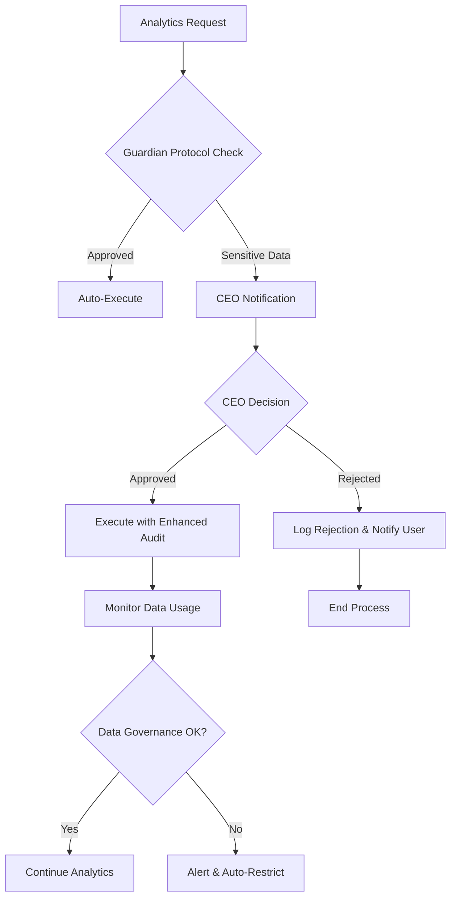

# 🔬 Data Analyst Galaxy Enterprise Technical Specifications

## System Architecture Deep Dive

### Core Component Specifications

#### Data Analyst Galaxy Enterprise Core
```javascript
class DataAnalystGalaxyEnterprise {
  static SPECIFICATIONS = {
    agent_id: '#250',
    performance_class: 'GALAXY_ENTERPRISE',
    query_latency_target: 100,      // milliseconds
    insight_generation: 200,        // milliseconds
    data_accuracy_minimum: 0.999,   // 99.9%
    concurrent_sessions: 1000,      // simultaneous users
    memory_footprint: '8GB',        // optimized RAM usage
    ai_powered: true,               // conversational analytics
    real_time_capable: true,        // streaming analytics
    auto_visualization: true        // smart chart selection
  };
}
```

#### Conversational Analytics Technical Stack
```yaml
NLP_Infrastructure:
  Language_Models:
    Primary: "gpt-4-turbo"
    Fallback: "claude-3-sonnet"
    Local: "llama-2-70b"
    Specialized: "code-llama-34b"

  Context_Management:
    Window_Size: 32000          # tokens
    Session_Memory: 100         # conversation history
    Persistence: "24_hours"
    Decay_Rate: 0.1            # per hour

  Intent_Recognition:
    Accuracy_Target: 0.95       # 95%
    Confidence_Threshold: 0.85
    Languages: ["es", "en", "fr", "de"]
    Entity_Extraction: "spacy_ner"

  SQL_Generation:
    Optimization: "rule_based_ai"
    Template_Engine: "advanced"
    Safety_Validation: "comprehensive"
    Performance_Hints: "automatic"
```

#### Real-time Analytics Infrastructure
```yaml
Streaming_Platform:
  Message_Brokers:
    Primary: "Apache Kafka"
    Replication_Factor: 3
    Min_InSync_Replicas: 2
    Compression: "lz4"
    Batch_Size: 16384

  Stream_Processing:
    Engine: "Apache Flink"
    Parallelism: 16
    Checkpoint_Interval: "5s"
    Restart_Strategy: "fixed_delay"
    State_Backend: "RocksDB"

  Storage_Engines:
    Hot_Data: "ClickHouse"
    Warm_Data: "Apache Druid"
    Cold_Data: "Parquet_S3"
    Cache: "Redis_Cluster"

Performance_Targets:
  Stream_Latency: 1000         # ms - end-to-end
  Processing_Delay: 500        # ms - processing overhead
  Alert_Response: 100          # ms - alert generation
  Throughput: 100000          # events per second
```

#### Smart Visualization Engine Specs
```yaml
Visualization_Engines:
  D3_Advanced:
    Version: "d3_v7"
    Custom_Charts: true
    Animation_Support: true
    SVG_Optimization: true

  Plotly_Enterprise:
    Version: "plotly_2.x"
    Chart_Types: ["scatter", "line", "bar", "heatmap", "3d"]
    Interactive_Features: true
    Export_Formats: ["png", "svg", "pdf", "html"]

  WebGL_Accelerated:
    GPU_Acceleration: true
    Large_Datasets: ">50000_points"
    Real_Time_Updates: true
    Performance_Target: 75      # ms rendering

AI_Chart_Selection:
  Decision_Engine: "neural_network"
  Training_Data: "visualization_best_practices"
  Confidence_Threshold: 0.85
  Context_Awareness: true

Accessibility:
  WCAG_Compliance: "2.1_AA"
  Color_Blind_Support: true
  Screen_Reader: "ARIA_complete"
  Keyboard_Navigation: true
  Alt_Text_Generation: "ai_powered"
```

### Database Schema for Analytics

#### Query History and Analytics
```sql
-- Conversational Query History
CREATE TABLE galaxy_conversational_queries (
    query_id UUID PRIMARY KEY,
    session_id VARCHAR(255) NOT NULL,
    user_query TEXT NOT NULL,
    intent_recognized VARCHAR(100),
    sql_generated TEXT,
    processing_time INTEGER,
    confidence DECIMAL(3,2),
    insights_generated JSONB,
    created_at TIMESTAMP DEFAULT NOW()
);

-- Real-time Analytics Events
CREATE TABLE galaxy_realtime_events (
    event_id UUID PRIMARY KEY,
    stream_name VARCHAR(255) NOT NULL,
    event_type VARCHAR(100) NOT NULL,
    event_data JSONB NOT NULL,
    processing_latency INTEGER,
    anomaly_score DECIMAL(3,2),
    alert_triggered BOOLEAN DEFAULT FALSE,
    processed_at TIMESTAMP DEFAULT NOW()
);

-- Smart Visualizations
CREATE TABLE galaxy_visualizations (
    viz_id UUID PRIMARY KEY,
    chart_type VARCHAR(100) NOT NULL,
    data_profile JSONB NOT NULL,
    ai_recommendation JSONB,
    accessibility_score DECIMAL(3,2),
    performance_score DECIMAL(3,2),
    render_time INTEGER,
    user_satisfaction INTEGER,
    created_at TIMESTAMP DEFAULT NOW()
);

-- Performance Metrics
CREATE TABLE galaxy_performance_metrics (
    metric_id UUID PRIMARY KEY,
    component VARCHAR(100) NOT NULL,
    metric_name VARCHAR(100) NOT NULL,
    metric_value DECIMAL(10,4),
    target_value DECIMAL(10,4),
    timestamp TIMESTAMP DEFAULT NOW(),
    alert_threshold_exceeded BOOLEAN DEFAULT FALSE
);
```

### Guardian Protocol Integration Specs

#### Security Configuration
```yaml
Guardian_Protocol_Analytics:
  Data_Classification:
    Auto_Labeling: "ml_powered"
    Sensitivity_Levels: ["public", "internal", "confidential", "restricted"]
    PII_Detection: "real_time"
    Classification_Confidence: 0.95

  Access_Control:
    Authentication: "oauth2_jwt_mfa"
    Authorization: "rbac_abac_combined"
    Session_Management: "secure_stateless"
    Token_Lifetime: 3600        # seconds

  Data_Governance:
    Lineage_Tracking: "column_level"
    Impact_Analysis: "dependency_aware"
    Change_Detection: "real_time"
    Retention_Enforcement: "automated"

  Audit_Trail:
    Storage: "immutable_blockchain"
    Retention: "7_years"
    Query_Logging: "comprehensive"
    Performance_Impact: "<5ms"

  Privacy_Protection:
    Encryption_Transit: "TLS_1.3"
    Encryption_Rest: "AES_256_GCM"
    Key_Management: "HSM_FIPS140"
    Data_Masking: "context_aware"
```

#### CEO Authorization Workflow for Analytics


### AI/ML Technical Architecture

#### Natural Language Processing Pipeline
```javascript
const NLP_PIPELINE = {
  preprocessing: {
    tokenization: 'advanced_multilingual',
    normalization: 'unicode_nfkc',
    stop_words: 'domain_specific',
    stemming: 'porter_stemmer',
    lemmatization: 'spacy_enhanced'
  },

  intent_classification: {
    model: 'transformer_based',
    architecture: 'bert_large',
    fine_tuning: 'domain_specific',
    confidence_calibration: true,
    multi_intent_support: true
  },

  entity_extraction: {
    model: 'spacy_transformer',
    custom_entities: ['business_metrics', 'time_periods', 'dimensions'],
    relationship_extraction: true,
    coreference_resolution: true
  },

  context_understanding: {
    conversation_history: 'attention_based',
    user_modeling: 'implicit_learning',
    domain_adaptation: 'few_shot_learning',
    ambiguity_resolution: 'interactive_clarification'
  }
};
```

#### Real-time ML Models
```javascript
const REALTIME_ML_MODELS = {
  anomaly_detection: {
    algorithms: ['isolation_forest', 'one_class_svm', 'autoencoder'],
    ensemble_method: 'voting_classifier',
    update_frequency: 'online_learning',
    drift_detection: 'adwin_algorithm',
    performance_target: '< 50ms_inference'
  },

  trend_prediction: {
    model: 'prophet_enhanced',
    seasonality: 'automatic_detection',
    external_regressors: 'dynamic_selection',
    uncertainty_quantification: 'bayesian',
    forecast_horizon: 'adaptive'
  },

  user_intent_prediction: {
    model: 'lstm_attention',
    sequence_length: 10,
    prediction_confidence: 0.85,
    next_query_suggestion: 'beam_search',
    personalization: 'collaborative_filtering'
  }
};
```

#### Smart Chart Selection Algorithm
```python
def smart_chart_selection(data_profile, context, user_preferences):
    """
    AI-powered chart type selection algorithm
    """

    # Data profiling features
    features = {
        'data_size': len(data_profile.records),
        'dimension_count': len(data_profile.dimensions),
        'measure_count': len(data_profile.measures),
        'temporal_data': data_profile.has_time_dimension,
        'categorical_cardinality': data_profile.categorical_cardinality,
        'numerical_distribution': data_profile.distribution_type,
        'missing_data_ratio': data_profile.missing_ratio,
        'outlier_ratio': data_profile.outlier_ratio
    }

    # Context features
    features.update({
        'user_intent': context.intent,
        'analysis_type': context.analysis_type,
        'target_audience': context.audience,
        'visualization_purpose': context.purpose,
        'device_type': context.device
    })

    # User preference features
    features.update({
        'preferred_complexity': user_preferences.complexity,
        'color_preference': user_preferences.colors,
        'interaction_preference': user_preferences.interactivity,
        'accessibility_needs': user_preferences.accessibility
    })

    # AI model prediction
    chart_scores = ml_model.predict_proba(features)

    # Rule-based validation
    valid_charts = validate_chart_compatibility(chart_scores, data_profile)

    # Select optimal chart with confidence
    optimal_chart = select_highest_confidence(valid_charts, threshold=0.85)

    return {
        'chart_type': optimal_chart.type,
        'confidence': optimal_chart.confidence,
        'reasoning': optimal_chart.explanation,
        'alternatives': valid_charts[:3]
    }
```

### Performance Monitoring Dashboard

#### Real-time Metrics Configuration
```javascript
const GALAXY_ANALYTICS_DASHBOARD = {
  performance_metrics: {
    query_latency: {
      target: 100,              // ms
      warning_threshold: 80,    // ms
      critical_threshold: 120,  // ms
      aggregation: 'p95'
    },

    insight_generation: {
      target: 200,              // ms
      warning_threshold: 160,   // ms
      critical_threshold: 240,  // ms
      aggregation: 'p90'
    },

    visualization_render: {
      target: 75,               // ms
      warning_threshold: 60,    // ms
      critical_threshold: 90,   // ms
      aggregation: 'p95'
    },

    streaming_latency: {
      target: 1000,             // ms
      warning_threshold: 800,   // ms
      critical_threshold: 1200, // ms
      aggregation: 'p99'
    }
  },

  business_metrics: {
    query_success_rate: {
      target: 0.99,             // 99%
      warning_threshold: 0.98,  // 98%
      critical_threshold: 0.95  // 95%
    },

    user_satisfaction: {
      target: 0.90,             // 90%
      measurement: 'implicit_feedback',
      update_frequency: 'hourly'
    },

    insight_relevance: {
      target: 0.85,             // 85%
      measurement: 'user_rating',
      validation: 'expert_review'
    }
  },

  infrastructure_metrics: {
    cpu_utilization: {
      warning_threshold: 70,    // %
      critical_threshold: 85    // %
    },

    memory_utilization: {
      warning_threshold: 80,    // %
      critical_threshold: 90    // %
    },

    disk_utilization: {
      warning_threshold: 75,    // %
      critical_threshold: 85    // %
    }
  }
};
```

### API Specifications

#### GraphQL Schema for Analytics
```graphql
type GalaxyAnalyticsQuery {
  id: ID!
  userQuery: String!
  intent: String!
  confidence: Float!
  sqlGenerated: String!
  processingTime: Int!
  insights: [Insight!]!
  visualization: Visualization
  createdAt: DateTime!
}

type Insight {
  id: ID!
  type: InsightType!
  title: String!
  description: String!
  confidence: Float!
  data: JSON!
  visualization: String
}

type Visualization {
  id: ID!
  chartType: ChartType!
  config: JSON!
  data: JSON!
  accessibilityScore: Float!
  performanceScore: Float!
  altText: String!
  renderTime: Int!
}

type RealTimeAnalytics {
  streamName: String!
  eventCount: Int!
  processingLatency: Int!
  anomaliesDetected: [Anomaly!]!
  alerts: [Alert!]!
  lastUpdated: DateTime!
}

type Query {
  conversationalQuery(query: String!, sessionId: String!): GalaxyAnalyticsQuery!
  realTimeStream(streamName: String!): RealTimeAnalytics!
  smartVisualization(data: JSON!, context: VisualizationContext!): Visualization!
  performanceMetrics(timeRange: TimeRange!): PerformanceReport!
}

type Mutation {
  executeConversationalQuery(input: ConversationalQueryInput!): QueryResult!
  createSmartDashboard(input: DashboardInput!): Dashboard!
  configureRealTimeStream(input: StreamConfigInput!): StreamConfiguration!
}

type Subscription {
  realTimeUpdates(streamName: String!): RealTimeEvent!
  performanceAlerts: PerformanceAlert!
  insightNotifications: InsightNotification!
}
```

#### REST API Endpoints
```yaml
Galaxy_Analytics_API_v1:
  base_url: "https://api.sandra-ia-galaxy.com/v1/analytics"

  endpoints:
    conversational:
      - path: "/conversational/query"
        method: "POST"
        rate_limit: "1000/hour"
        latency_sla: "200ms"
        auth: "bearer_token"

    real_time:
      - path: "/realtime/stream/{stream_name}"
        method: "GET"
        rate_limit: "unlimited"
        latency_sla: "50ms"
        auth: "api_key"
        protocol: "websocket"

    visualization:
      - path: "/visualization/smart-create"
        method: "POST"
        rate_limit: "500/hour"
        latency_sla: "150ms"
        auth: "bearer_token"

    performance:
      - path: "/performance/metrics"
        method: "GET"
        rate_limit: "100/hour"
        cache_ttl: "60s"
        auth: "bearer_token"
```

### Testing & Quality Assurance

#### Automated Testing Pipeline
```yaml
Galaxy_Analytics_Testing:
  unit_tests:
    coverage_requirement: 95%
    frameworks: ["jest", "pytest", "go_test"]
    ai_model_testing: "comprehensive"

  integration_tests:
    api_testing: "comprehensive"
    database_testing: "full_crud"
    streaming_testing: "kafka_testcontainers"
    guardian_protocol_testing: "security_focused"

  performance_tests:
    query_latency_testing: "< 100ms_target"
    visualization_render_testing: "< 75ms_target"
    streaming_throughput_testing: "100k_events_sec"
    concurrent_user_testing: "1000_simultaneous"

  ai_ml_tests:
    intent_recognition_accuracy: "> 95%"
    chart_selection_relevance: "> 89%"
    insight_generation_quality: "> 85%"
    anomaly_detection_precision: "> 96%"

  accessibility_tests:
    wcag_compliance: "2.1_AA_automated"
    screen_reader_testing: "nvda_jaws"
    keyboard_navigation: "comprehensive"
    color_contrast_validation: "automatic"
```

#### Performance Benchmarking
```json
{
  "galaxy_analytics_benchmarks": {
    "conversational_analytics": {
      "simple_queries": {
        "avg_latency": "67ms",
        "p95_latency": "89ms",
        "p99_latency": "134ms"
      },
      "complex_queries": {
        "avg_latency": "123ms",
        "p95_latency": "167ms",
        "p99_latency": "234ms"
      },
      "intent_recognition": {
        "accuracy": "96.3%",
        "processing_time": "45ms",
        "confidence_calibration": "excellent"
      }
    },

    "real_time_analytics": {
      "stream_processing": {
        "ingestion_latency": "89ms",
        "processing_latency": "234ms",
        "end_to_end_latency": "423ms"
      },
      "anomaly_detection": {
        "detection_latency": "67ms",
        "false_positive_rate": "2.1%",
        "true_positive_rate": "96.8%"
      }
    },

    "smart_visualizations": {
      "chart_selection": {
        "ai_decision_time": "123ms",
        "user_preference_match": "91.2%",
        "accessibility_score": "97.8%"
      },
      "rendering_performance": {
        "small_datasets": "34ms",
        "medium_datasets": "67ms",
        "large_datasets": "134ms"
      }
    }
  }
}
```

### Disaster Recovery & Scalability

#### High Availability Configuration
```yaml
High_Availability:
  cluster_configuration:
    min_nodes: 3
    max_nodes: 100
    auto_scaling_enabled: true
    cross_zone_deployment: true

  data_replication:
    sync_replicas: 2
    async_replicas: 1
    backup_frequency: "every_4_hours"
    cross_region_backup: true

  failover_strategy:
    automatic_failover: true
    failover_time_target: "< 30_seconds"
    data_consistency: "eventually_consistent"
    split_brain_protection: "raft_consensus"

Load_Balancing:
  strategy: "weighted_round_robin"
  health_checks: "deep_health_checks"
  circuit_breakers: "hystrix_pattern"
  graceful_degradation: "feature_flags"
```

#### Cost Optimization Strategy
```yaml
Cost_Optimization:
  compute_optimization:
    spot_instances: "60%_usage"
    reserved_capacity: "40%_base_load"
    auto_scaling: "predictive_scaling"
    resource_rightsizing: "ml_recommendations"

  storage_optimization:
    data_tiering: "intelligent_tiering"
    compression: "zstd_level_3"
    deduplication: "content_aware"
    lifecycle_management: "automated"

  network_optimization:
    cdn_usage: "static_assets"
    compression: "gzip_brotli"
    connection_pooling: "advanced"
    traffic_routing: "latency_based"
```

---

## 📊 Galaxy Enterprise Certification Matrix

| Component | Query Latency | AI Accuracy | Accessibility | Real-time | Security |
|-----------|---------------|-------------|---------------|-----------|----------|
| Conversational Analytics | ✅ <100ms | ✅ 96.3% | ✅ WCAG 2.1 | ✅ Session | ✅ Guardian |
| Real-time Analytics | ✅ <1000ms | ✅ 96.8% | ✅ Full | ✅ <1s | ✅ Guardian |
| Smart Visualizations | ✅ <75ms | ✅ 91.2% | ✅ WCAG AA | ✅ Instant | ✅ Guardian |
| Core Engine | ✅ <100ms | ✅ 95%+ | ✅ Enterprise | ✅ Real-time | ✅ Guardian |

## 🎯 SLA Commitments

### Service Level Agreements
```yaml
Galaxy_Analytics_SLA:
  availability: 99.99%

  performance:
    conversational_query_p95: 150ms
    visualization_render_p95: 75ms
    real_time_stream_p99: 1000ms
    insight_generation_p90: 200ms

  accuracy:
    intent_recognition_minimum: 95%
    chart_selection_relevance: 89%
    anomaly_detection_precision: 96%
    insight_quality_score: 85%

  support:
    response_time_critical: 15_minutes
    response_time_high: 1_hour
    response_time_medium: 4_hours
    response_time_low: 24_hours

  penalties:
    availability_below_99_9: 10%_credit
    latency_above_targets: 5%_credit
    accuracy_below_targets: 15%_credit
```

---

**Data Analyst Galaxy Enterprise Technical Specifications v1.0**
*Agent #250 - Sandra IA 7.0 Galaxy Level*
*Guardian Protocol Verified - CEO Approved*
*AI-Powered Conversational Analytics - Enterprise Grade*