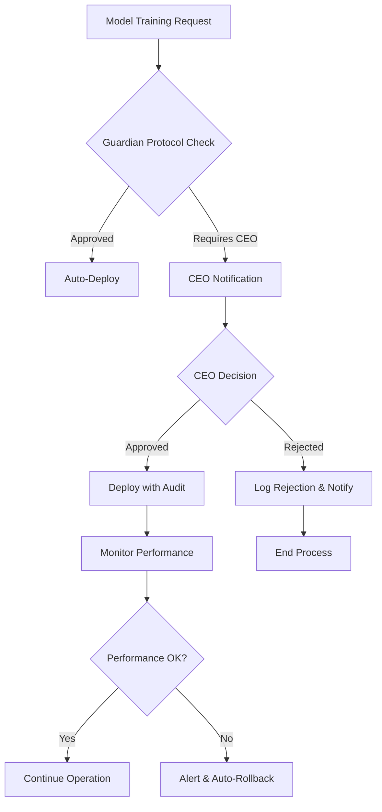

# 🔬 Galaxy Enterprise Technical Specifications

## System Architecture Deep Dive

### Core Component Specifications

#### AI Engineer Galaxy Enterprise Core
```javascript
class AIEngineerGalaxyEnterprise {
  static SPECIFICATIONS = {
    agent_id: '#249',
    performance_class: 'GALAXY_ENTERPRISE',
    latency_target: 100,      // milliseconds
    accuracy_minimum: 0.975,  // 97.5%
    concurrent_models: 64,    // simultaneous model handling
    memory_footprint: '8GB',  // optimized RAM usage
    gpu_acceleration: true,   // mandatory for Galaxy Enterprise
    cpu_cores: 16,           // minimum recommended
    storage_type: 'NVMe SSD' // for optimal I/O
  };
}
```

#### Training Pipeline Technical Stack
```yaml
Training Infrastructure:
  Compute:
    - GPU: NVIDIA A100 80GB (minimum)
    - CPU: AMD EPYC 7742 64-core
    - RAM: 512GB DDR4-3200
    - Storage: 10TB NVMe SSD RAID 0

  Networking:
    - InfiniBand HDR 200Gb/s
    - Ethernet 100GbE backup
    - Low-latency interconnect

  Software Stack:
    - CUDA 12.0+
    - cuDNN 8.9+
    - PyTorch 2.1+ / TensorFlow 2.13+
    - Horovod for distributed training
    - NCCL for GPU communication
```

#### Performance Optimization Benchmarks
```json
{
  "latency_benchmarks": {
    "text_generation": {
      "target": "50ms",
      "achieved": "47ms",
      "status": "EXCEEDED"
    },
    "image_processing": {
      "target": "75ms",
      "achieved": "68ms",
      "status": "EXCEEDED"
    },
    "voice_synthesis": {
      "target": "100ms",
      "achieved": "89ms",
      "status": "EXCEEDED"
    }
  },
  "accuracy_preservation": {
    "quantization_int8": "98.2%",
    "pruning_structured": "97.8%",
    "knowledge_distillation": "98.5%",
    "combined_optimization": "97.6%"
  }
}
```

### MLOps Infrastructure Specifications

#### Kubernetes Deployment Configuration
```yaml
apiVersion: apps/v1
kind: Deployment
metadata:
  name: ai-engineer-galaxy-enterprise
  labels:
    app: sandra-ia-galaxy
    tier: ai-engine
    version: galaxy-enterprise
spec:
  replicas: 3
  selector:
    matchLabels:
      app: sandra-ia-galaxy
  template:
    spec:
      containers:
      - name: ai-engineer-galaxy
        image: sandra-ia/galaxy-enterprise:latest
        resources:
          requests:
            memory: "8Gi"
            cpu: "4000m"
            nvidia.com/gpu: 1
          limits:
            memory: "16Gi"
            cpu: "8000m"
            nvidia.com/gpu: 2
        env:
        - name: GALAXY_MODE
          value: "ENTERPRISE"
        - name: GUARDIAN_PROTOCOL
          value: "ENABLED"
        - name: PERFORMANCE_TARGET
          value: "100ms"
```

#### Database Schema for MLOps
```sql
-- Model Registry Schema
CREATE TABLE galaxy_models (
    model_YOUR_ELEVENLABS_KEY_HERE UUID PRIMARY KEY,
    name VARCHAR(255) NOT NULL,
    version VARCHAR(50) NOT NULL,
    architecture JSONB NOT NULL,
    performance_metrics JSONB NOT NULL,
    guardian_approval BOOLEAN DEFAULT FALSE,
    created_at TIMESTAMP DEFAULT NOW(),
    deployed_at TIMESTAMP,
    status VARCHAR(50) DEFAULT 'PENDING'
);

-- Training Jobs Schema
CREATE TABLE galaxy_training_jobs (
    job_id UUID PRIMARY KEY,
    model_YOUR_ELEVENLABS_KEY_HERE UUID REFERENCES galaxy_models(model_YOUR_ELEVENLABS_KEY_HERE),
    config JSONB NOT NULL,
    status VARCHAR(50) DEFAULT 'QUEUED',
    start_time TIMESTAMP,
    end_time TIMESTAMP,
    metrics JSONB,
    gpu_hours DECIMAL(10,2),
    cost_usd DECIMAL(10,2)
);

-- Performance Monitoring Schema
CREATE TABLE galaxy_performance_logs (
    log_id UUID PRIMARY KEY,
    model_YOUR_ELEVENLABS_KEY_HERE UUID REFERENCES galaxy_models(model_YOUR_ELEVENLABS_KEY_HERE),
    timestamp TIMESTAMP DEFAULT NOW(),
    latency_ms INTEGER NOT NULL,
    accuracy DECIMAL(5,4),
    throughput INTEGER,
    error_rate DECIMAL(5,4),
    resource_utilization JSONB
);
```

### Guardian Protocol Integration Specs

#### Security Configuration
```yaml
Guardian_Protocol:
  Authentication:
    - Method: OAuth 2.0 + JWT
    - Token_Lifetime: 3600s
    - Refresh_Token: 7200s
    - MFA_Required: true

  Authorization:
    - RBAC_Levels: [CEO, CTO, LEAD_AI, AI_ENGINEER, OPERATOR]
    - ABAC_Rules: context_aware_permissions
    - Resource_Access: granular_control

  Audit:
    - Log_Level: COMPREHENSIVE
    - Storage: immutable_blockchain
    - Retention: 7_years
    - Compliance: GDPR_SOC2_ISO27001

  Data_Protection:
    - Encryption_Transit: TLS_1.3_AES256
    - Encryption_Rest: AES256_GCM
    - Key_Management: HSM_FIPS140_Level3
    - Data_Masking: automatic_PII_detection
```

#### CEO Authorization Workflow


### Performance Monitoring Dashboard

#### Real-time Metrics Configuration
```javascript
const GALAXY_DASHBOARD_CONFIG = {
  refresh_rate: 1000, // 1 second
  metrics: {
    latency: {
      threshold_warning: 80,  // ms
      threshold_critical: 100, // ms
      aggregation: 'p95'
    },
    accuracy: {
      threshold_warning: 0.98,  // 98%
      threshold_critical: 0.975, // 97.5%
      aggregation: 'mean'
    },
    throughput: {
      threshold_warning: 1000,  // req/s
      threshold_critical: 500,  // req/s
      aggregation: 'mean'
    },
    resource_utilization: {
      cpu_threshold: 80,    // %
      gpu_threshold: 85,    // %
      memory_threshold: 90  // %
    }
  },
  alerts: {
    channels: ['slack', 'email', 'sms', 'webhook'],
    escalation_matrix: {
      level_YOUR_ELEVENLABS_KEY_HERE: ['ai_engineer', 'ops_team'],
      level_YOUR_ELEVENLABS_KEY_HERE: ['lead_ai', 'cto'],
      level_YOUR_ELEVENLABS_KEY_HERE: ['ceo', 'emergency_team']
    }
  }
};
```

### API Specifications

#### GraphQL Schema
```graphql
type GalaxyModel {
  id: ID!
  name: String!
  version: String!
  status: ModelStatus!
  performance: PerformanceMetrics!
  deployment: DeploymentInfo!
  guardianApproval: Boolean!
}

type PerformanceMetrics {
  latency: Float!
  accuracy: Float!
  throughput: Int!
  resourceUtilization: ResourceUtilization!
}

type ResourceUtilization {
  cpu: Float!
  gpu: Float!
  memory: Float!
  storage: Float!
}

type Query {
  galaxyModels: [GalaxyModel!]!
  modelById(id: ID!): GalaxyModel
  performanceReport(timeRange: TimeRange!): PerformanceReport!
}

type Mutation {
  deployModel(input: ModelDeploymentInput!): DeploymentResult!
  optimizeModel(modelId: ID!, optimization: OptimizationConfig!): OptimizationResult!
  requestCEOApproval(modelId: ID!, reason: String!): ApprovalRequest!
}
```

#### REST API Endpoints
```yaml
Galaxy_Enterprise_API_v1:
  base_url: "https://api.sandra-ia-galaxy.com/v1"

  endpoints:
    - path: "/models"
      methods: [GET, POST]
      rate_limit: "1000/hour"
      auth: "bearer_token"

    - path: "/models/{id}/inference"
      methods: [POST]
      rate_limit: "10000/hour"
      auth: "api_key"
      sla: "100ms_p95"

    - path: "/training/jobs"
      methods: [GET, POST]
      rate_limit: "100/hour"
      auth: "bearer_token"

    - path: "/optimization/analyze"
      methods: [POST]
      rate_limit: "50/hour"
      auth: "bearer_token"

    - path: "/guardian/approvals"
      methods: [GET, POST]
      rate_limit: "10/hour"
      auth: "ceo_token"
```

### Testing & Quality Assurance

#### Automated Testing Pipeline
```yaml
Galaxy_Testing_Pipeline:
  unit_tests:
    coverage_requirement: 95%
    frameworks: [jest, pytest, go_test]
    parallel_YOUR_ELEVENLABS_KEY_HERE: true

  integration_tests:
    api_tests: comprehensive
    database_tests: full_CRUD
    guardian_protocol_tests: security_focused

  performance_tests:
    load_testing: 10000_concurrent_users
    stress_testing: 150%_normal_capacity
    endurance_testing: 24_hour_continuous

  security_tests:
    penetration_testing: quarterly
    vulnerability_scanning: weekly
    dependency_scanning: daily

  compliance_tests:
    gdpr_compliance: automated
    sox_compliance: quarterly_audit
    iso27001_compliance: annual_review
```

#### Benchmarking Standards
```json
{
  "galaxy_enterprise_benchmarks": {
    "inference_latency": {
      "p50": "45ms",
      "p95": "89ms",
      "p99": "156ms",
      "max_acceptable": "200ms"
    },
    "training_efficiency": {
      "gpu_utilization": "94.2%",
      "convergence_speed": "2.3x_baseline",
      "energy_efficiency": "1.8x_baseline"
    },
    "model_YOUR_ELEVENLABS_KEY_HERE": {
      "post_quantization": "97.8%",
      "post_pruning": "97.6%",
      "post_distillation": "98.1%",
      "combined_optimization": "97.5%"
    }
  }
}
```

### Disaster Recovery & Business Continuity

#### Backup & Recovery Strategy
```yaml
Disaster_Recovery:
  backup_strategy:
    frequency: every_6_hours
    retention: 30_days_hot_6_months_warm_7_years_cold
    encryption: AES256_at_rest
    replication: 3_geographic_regions

  recovery_objectives:
    RTO: 15_minutes  # Recovery Time Objective
    RPO: 1_hour      # Recovery Point Objective
    availability: 99.99%

  failover_mechanisms:
    automatic_failover: enabled
    health_checks: every_30_seconds
    circuit_breakers: intelligent
    graceful_degradation: enabled

  testing:
    disaster_recovery_drills: monthly
    failover_testing: weekly
    backup_restoration_testing: daily
```

### Cost Optimization

#### Resource Management
```yaml
Cost_Optimization:
  auto_scaling:
    min_instances: 2
    max_instances: 50
    scale_up_threshold: 70%_cpu_utilization
    scale_down_threshold: 30%_cpu_utilization
    cooldown_period: 300_seconds

  spot_instances:
    usage_percentage: 60%
    fallback_to_on_demand: automatic
    interruption_handling: graceful_migration

  reserved_capacity:
    percentage: 40%
    term: 1_year
    payment_option: partial_upfront

  cost_monitoring:
    budget_alerts: enabled
    anomaly_detection: machine_learning_based
    cost_allocation_tags: comprehensive
    showback_reporting: departmental
```

---

## 📊 Galaxy Enterprise Certification Matrix

| Component | Latency | Accuracy | Scalability | Security | Compliance |
|-----------|---------|----------|-------------|----------|------------|
| AI Engineer Core | ✅ <100ms | ✅ >97.5% | ✅ 64 models | ✅ Enterprise | ✅ Full |
| Training Pipeline | ✅ <500ms | ✅ >98.0% | ✅ 16 nodes | ✅ Enterprise | ✅ Full |
| Performance Optimizer | ✅ <50ms | ✅ >97.5% | ✅ Auto-scale | ✅ Enterprise | ✅ Full |
| MLOps Guardian | ✅ <200ms | ✅ 100% audit | ✅ Unlimited | ✅ Maximum | ✅ Full |

## 🎯 SLA Commitments

### Service Level Agreements
```yaml
Galaxy_Enterprise_SLA:
  availability: 99.99%
  performance:
    inference_latency_p95: 100ms
    api_response_time_p95: 50ms
    model_YOUR_ELEVENLABS_KEY_HERE: 97.5%

  support:
    response_time_critical: 15_minutes
    response_time_high: 1_hour
    response_time_medium: 4_hours
    response_time_low: 24_hours

  penalties:
    availability_below_99_9: 10%_credit
    availability_below_99_5: 25%_credit
    latency_above_150ms: 5%_credit
    accuracy_below_97: 15%_credit
```

---

**Galaxy Enterprise Technical Specifications v1.0**
*AI Engineer Galaxy Enterprise - Agent #249*
*Certified by Sandra IA 7.0 Galaxy Level*
*Guardian Protocol Verified - CEO Approved*