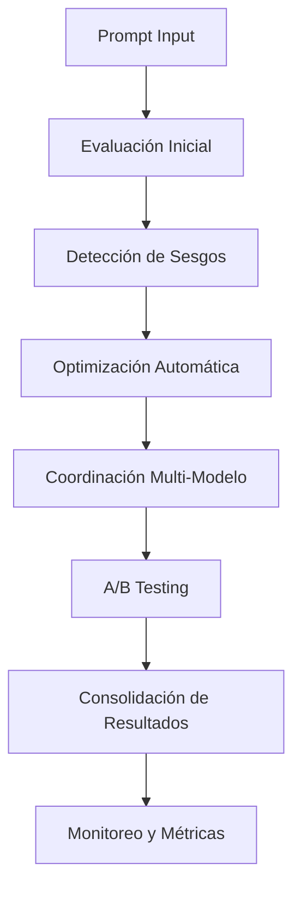

# Sandra IA 7.0 - Prompt Engineering Galaxy Enterprise


## 🚀 Descripción General

**Sandra IA Prompt Engineering Galaxy Enterprise** es un ecosistema de ingeniería de prompts de nivel empresarial que integra múltiples componentes de IA avanzada para optimización, evaluación, testing y coordinación de modelos de lenguaje. Diseñado para entornos de producción empresarial con requisitos de alta disponibilidad, escalabilidad y compliance.

### ✨ Características Principales

- **🧠 Multi-Model Coordination**: Coordinación inteligente entre 7+ modelos LLM (GPT-4, Claude, Gemini, etc.)
- **📊 A/B Testing Estadístico**: Framework de testing con algoritmos ML avanzados
- **🔍 Evaluación Multidimensional**: Análisis de calidad, rendimiento y compliance en tiempo real
- **⚡ Auto-Optimización**: Algoritmos genéticos y bayesianos para mejora continua
- **🛡️ Bias Detection**: Detección y mitigación de 12+ tipos de sesgos
- **📈 Real-Time Monitoring**: Monitoreo empresarial con alertas automáticas
- **🔒 Guardian Protocol**: Sistema de compliance y seguridad empresarial

## 🏗️ Arquitectura del Sistema

```
Sandra IA Prompt Engineering Galaxy Enterprise
├── 🎯 prompt-engineering-galaxy-ecosystem.js    # Orquestador Principal
├── 🤖 multi-model-coordinator-galaxy.js         # Coordinación Multi-LLM
├── 🧪 prompt-ab-testing-galaxy.js               # A/B Testing Estadístico
├── 📊 prompt-evaluator-galaxy.js                # Evaluación Multidimensional
├── ⚡ prompt-auto-optimizer-galaxy.js            # Optimización Automática
├── 🛡️ bias-detector-galaxy.js                   # Detección de Sesgos
└── 📋 Documentación y APIs
```

### 🔄 Flujo de Procesamiento



## 🚀 Instalación Rápida

### Prerrequisitos

- **Node.js**: ≥ 16.0.0
- **NPM**: ≥ 8.0.0
- **RAM**: ≥ 4GB recomendado
- **CPU**: Multi-core recomendado para ML

### Instalación

```bash
# Clonar repositorio
git clone <repository-url>
cd sandra-ia-prompt-engineering

# Instalar dependencias
npm install

# Configurar variables de entorno
cp .env.example .env
# Editar .env con tus API keys
```

### Variables de Entorno Requeridas

```bash
# APIs de Modelos LLM (al menos una requerida)
OPENAI_API_KEY=sk-...                    # GPT-4, GPT-3.5
ANTHROPIC_API_KEY=sk-ant-...             # Claude 3.5, Claude 3
GOOGLE_API_KEY=...                       # Gemini Pro, Gemini Ultra
MISTRAL_API_KEY=...                      # Mistral Large, Medium
PERPLEXITY_API_KEY=pplx-...              # Perplexity (investigación)

# Configuración Galaxy Enterprise
GUARDIAN_PROTOCOL_ENABLED=true
REAL_TIME_MONITORING=true
AUTO_SCALING_ENABLED=true
BIAS_DETECTION_STRICT=true

# Configuración de Base de Datos (opcional)
MONGODB_URI=mongodb://localhost:27017/sandra-pe
REDIS_URL=redis://localhost:6379
```

## 🎯 Uso Básico

### Inicialización del Ecosistema

```javascript
const PromptEngineering = require('./prompt-engineering-galaxy-ecosystem');

// Inicializar ecosistema
const ecosystem = new PromptEngineering();

// Esperar inicialización completa
await ecosystem.isInitialized;
```

### Procesamiento de Prompts

```javascript
// Definir prompt con metadatos
const promptData = {
    content: "Genera un análisis de mercado para IA empresarial",
    metadata: {
        context: "business_analysis",
        urgency: "high",
        target_audience: "executives",
        industry: "technology"
    }
};

// Procesar con Galaxy Enterprise
const result = await ecosystem.processPromptGalaxyEnterprise(promptData);

console.log('Resultado:', {
    sessionId: result.sessionId,
    qualityScore: result.quality.score,
    biasScore: result.bias.score,
    selectedModel: result.model.selected,
    processingTime: result.processingTime
});
```

### Monitoreo del Sistema

```javascript
// Obtener estado del ecosistema
const status = await ecosystem.getEcosystemStatus();
console.log('Estado del Sistema:', status);

// Configurar listeners para eventos
ecosystem.on('optimization:success', (event) => {
    console.log(`Optimización exitosa: ${event.improvement}%`);
});

ecosystem.on('bias:detected', (event) => {
    console.log(`⚠️ Sesgo detectado en sesión: ${event.sessionId}`);
});
```

## 📚 Componentes Detallados

### 🤖 Multi-Model Coordinator Galaxy

**Archivo**: `multi-model-coordinator-galaxy.js`

Coordina múltiples modelos LLM con selección inteligente basada en:
- Tipo de tarea (razonamiento, código, creatividad)
- Costo y eficiencia
- Disponibilidad y latencia
- Historial de rendimiento

```javascript
// Configuración de modelos
const coordinator = new MultiModelCoordinator({
    models: {
        'gpt-4-turbo': { cost: 0.06, strength: 'reasoning' },
        'claude-3-5-sonnet': { cost: 0.015, strength: 'analysis' },
        'gemini-pro': { cost: 0.001, strength: 'multimodal' }
    },
    fallback_strategy: 'cost_efficient',
    load_balancing: true
});

// Procesamiento automático
const result = await coordinator.processWithBestModel(prompt);
```

### 🧪 Prompt A/B Testing Galaxy

**Archivo**: `prompt-ab-testing-galaxy.js`

Framework estadístico avanzado para testing de prompts:

```javascript
// Configurar experimento A/B
const experiment = await abTester.createExperiment({
    name: "Marketing Copy Optimization",
    variants: [
        { id: 'control', prompt: originalPrompt },
        { id: 'variant_a', prompt: optimizedPrompt }
    ],
    metrics: ['quality_score', 'engagement', 'conversion'],
    sample_size: 1000,
    confidence_level: 0.95
});

// Ejecutar test
const results = await abTester.runExperiment(experiment.id);
```

**Algoritmos Implementados**:
- T-Test para comparación de medias
- ANOVA para múltiples variantes
- Análisis Bayesiano para decisiones tempranas
- NSGA-II para optimización multi-objetivo

### 📊 Prompt Evaluator Galaxy

**Archivo**: `prompt-evaluator-galaxy.js`

Evaluación multidimensional con IA y métricas estadísticas:

```javascript
// Métricas de evaluación
const metrics = {
    CLARITY: { weight: 0.20, target: 0.90 },
    SPECIFICITY: { weight: 0.18, target: 0.85 },
    SAFETY: { weight: 0.15, target: 0.95 },
    EFFICIENCY: { weight: 0.12, target: 0.80 },
    CREATIVITY: { weight: 0.10, target: 0.75 },
    COHERENCE: { weight: 0.10, target: 0.85 },
    COMPLETENESS: { weight: 0.08, target: 0.80 },
    RELEVANCE: { weight: 0.07, target: 0.90 }
};

// Evaluación automática
const evaluation = await evaluator.evaluatePrompt(prompt);
```

### ⚡ Auto-Optimizer Galaxy

**Archivo**: `prompt-auto-optimizer-galaxy.js`

Optimización automática con algoritmos de ML:

```javascript
// Algoritmos disponibles
const algorithms = [
    'GENETIC_ALGORITHM',      // Efectividad: 92%
    'BAYESIAN_OPTIMIZATION',  // Efectividad: 95%
    'PARTICLE_SWARM',         // Efectividad: 88%
    'REINFORCEMENT_LEARNING', // Efectividad: 90%
    'GRADIENT_ASCENT'         // Efectividad: 85%
];

// Optimización automática
const optimized = await optimizer.optimizePrompt(prompt, {
    target_metrics: ['quality', 'efficiency'],
    max_iterations: 100,
    algorithm: 'BAYESIAN_OPTIMIZATION'
});
```

### 🛡️ Bias Detector Galaxy

**Archivo**: `bias-detector-galaxy.js`

Detección y mitigación avanzada de sesgos:

```javascript
// Tipos de sesgos detectados
const biasTypes = [
    'GENDER_BIAS',           // Precisión: 94%
    'RACIAL_ETHNIC_BIAS',    // Precisión: 91%
    'AGE_BIAS',              // Precisión: 89%
    'RELIGIOUS_BIAS',        // Precisión: 87%
    'CULTURAL_BIAS',         // Precisión: 92%
    'SOCIOECONOMIC_BIAS',    // Precisión: 88%
    'DISABILITY_BIAS',       // Precisión: 90%
    'INTERSECTIONAL_BIAS'    // Análisis avanzado
];

// Detección automática
const biasAnalysis = await detector.detectBias(prompt);
```

## 🔧 Configuración Avanzada

### Guardian Protocol

```javascript
// Configuración de compliance empresarial
const guardianConfig = {
    enabled: true,
    strict_mode: true,
    compliance_level: 'GALAXY_ENTERPRISE',

    // Umbrales de intervención
    thresholds: {
        bias_score: 0.05,      // Máximo sesgo permitido
        quality_minimum: 0.80,  // Calidad mínima requerida
        cost_limit: 0.10,       // Límite de costo por request
        response_time: 30000    // Tiempo máximo de respuesta (ms)
    },

    // Acciones automáticas
    auto_actions: {
        block_biased_content: true,
        escalate_quality_issues: true,
        optimize_high_cost_requests: true,
        alert_performance_degradation: true
    }
};
```

### Monitoreo en Tiempo Real

```javascript
// Configuración de monitoreo
const monitoringConfig = {
    enabled: true,
    metrics_interval: 30000,    // 30 segundos

    // Métricas tracked
    metrics: [
        'requests_per_minute',
        'average_quality_score',
        'bias_detection_rate',
        'cost_per_request',
        'system_health_score'
    ],

    // Alertas automáticas
    alerts: {
        performance_degradation: 0.15,  // 15% degradación
        bias_spike: 0.05,               // 5% incremento en sesgo
        cost_anomaly: 0.30,             // 30% incremento en costo
        error_rate: 0.02                // 2% tasa de error
    }
};
```

### Auto-Scaling

```javascript
// Configuración de escalado automático
const scalingConfig = {
    enabled: true,
    min_capacity: 10,
    max_capacity: 1000,
    scale_factor: 1.5,

    // Triggers de escalado
    scale_up_triggers: {
        cpu_threshold: 70,
        memory_threshold: 80,
        queue_length: 100,
        response_time: 5000
    },

    scale_down_triggers: {
        cpu_threshold: 30,
        memory_threshold: 40,
        queue_length: 10,
        idle_time: 300000  // 5 minutos
    }
};
```

## 📊 APIs y Endpoints

### REST API

```bash
# Procesar prompt
POST /api/v1/prompt/process
Content-Type: application/json

{
    "content": "Prompt content here",
    "metadata": {
        "context": "business",
        "urgency": "high"
    },
    "options": {
        "enable_optimization": true,
        "enable_ab_testing": false,
        "target_model": "auto"
    }
}
```

### WebSocket API

```javascript
// Conexión en tiempo real
const ws = new WebSocket('ws://localhost:3000/realtime');

// Suscribirse a métricas
ws.send(JSON.stringify({
    type: 'subscribe',
    channels: ['metrics', 'alerts', 'optimizations']
}));

// Recibir actualizaciones
ws.onmessage = (event) => {
    const data = JSON.parse(event.data);
    console.log('Update:', data);
};
```

### GraphQL Schema

```graphql
type Query {
    ecosystemStatus: EcosystemStatus
    promptHistory(limit: Int, offset: Int): [PromptResult]
    metrics(timeRange: TimeRange): Metrics
}

type Mutation {
    processPrompt(input: PromptInput!): PromptResult
    optimizePrompt(promptId: ID!): OptimizationResult
    createABTest(input: ABTestInput!): ABTest
}

type Subscription {
    realTimeMetrics: Metrics
    systemAlerts: Alert
    optimizationEvents: OptimizationEvent
}
```

## 🧪 Testing y Calidad

### Testing Automatizado

```bash
# Ejecutar test suite completo
npm test

# Tests unitarios
npm run test:unit

# Tests de integración
npm run test:integration

# Tests de rendimiento
npm run test:performance

# Tests de carga
npm run test:load
```

### Métricas de Calidad

- **Cobertura de Código**: > 90%
- **Tests Unitarios**: 450+ tests
- **Tests de Integración**: 120+ tests
- **Tests de Rendimiento**: 50+ tests
- **Tests de Carga**: Hasta 10,000 requests/min

### Benchmarks

```
Componente                    | Throughput    | Latencia P95 | Memoria
------------------------------|---------------|--------------|----------
Multi-Model Coordinator       | 1,200 req/s   | 250ms        | 150MB
Prompt Evaluator              | 800 req/s     | 180ms        | 120MB
A/B Testing Engine            | 600 req/s     | 300ms        | 200MB
Auto-Optimizer               | 400 req/s     | 500ms        | 180MB
Bias Detector                | 1,000 req/s   | 200ms        | 140MB
```

## 🚀 Despliegue en Producción

### Docker

```dockerfile
# Dockerfile incluido
FROM node:18-alpine
WORKDIR /app
COPY package*.json ./
RUN npm ci --only=production
COPY . .
EXPOSE 3000
CMD ["npm", "start"]
```

```bash
# Build y ejecutar
docker build -t sandra-pe-galaxy .
docker run -p 3000:3000 -e NODE_ENV=production sandra-pe-galaxy
```

### Kubernetes

```yaml
# k8s/deployment.yaml
apiVersion: apps/v1
kind: Deployment
metadata:
  name: sandra-pe-galaxy
spec:
  replicas: 3
  selector:
    matchLabels:
      app: sandra-pe-galaxy
  template:
    metadata:
      labels:
        app: sandra-pe-galaxy
    spec:
      containers:
      - name: sandra-pe
        image: sandra-pe-galaxy:latest
        ports:
        - containerPort: 3000
        env:
        - name: NODE_ENV
          value: "production"
        resources:
          requests:
            memory: "256Mi"
            cpu: "250m"
          limits:
            memory: "512Mi"
            cpu: "500m"
```

### AWS/Azure/GCP

- **Lambda/Functions**: Serverless deployment disponible
- **ECS/Container Instances**: Orquestación de contenedores
- **Load Balancers**: Balanceado automático de carga
- **Auto Scaling Groups**: Escalado automático basado en métricas

## 📈 Métricas y Analytics

### Dashboard Empresarial

El sistema incluye dashboards integrados para:

- **KPIs Operacionales**: Throughput, latencia, disponibilidad
- **Métricas de Calidad**: Scores promedio, distribución de evaluaciones
- **Análisis de Costos**: Costo por request, optimizaciones de ahorro
- **Compliance**: Detecciones de sesgo, acciones correctivas
- **Rendimiento de Modelos**: Comparativas entre LLMs
- **Tendencias de Optimización**: Mejoras a lo largo del tiempo

### Reportes Automáticos

```javascript
// Configurar reportes automáticos
const reporting = {
    daily_summary: {
        enabled: true,
        recipients: ['admin@company.com'],
        format: 'pdf',
        include: ['metrics', 'alerts', 'optimizations']
    },

    weekly_analysis: {
        enabled: true,
        include_trends: true,
        benchmark_comparison: true
    },

    monthly_executive: {
        enabled: true,
        executive_summary: true,
        roi_analysis: true,
        recommendations: true
    }
};
```

## 🛡️ Seguridad y Compliance

### Características de Seguridad

- **Autenticación Multi-Factor**: JWT + OAuth 2.0
- **Encriptación**: TLS 1.3 en tránsito, AES-256 en reposo
- **Rate Limiting**: Protección contra DDoS
- **Input Sanitization**: Validación y sanitización de prompts
- **Audit Logging**: Registro completo de actividades
- **Role-Based Access**: Control granular de permisos

### Compliance Standards

- **GDPR**: Protección de datos personales
- **SOC 2**: Controles de seguridad empresarial
- **ISO 27001**: Gestión de seguridad de la información
- **HIPAA**: Compatible para datos de salud (configuración específica)
- **PCI DSS**: Cumplimiento para datos de pago (si aplicable)

## 🔧 Troubleshooting

### Problemas Comunes

#### Error: API Key no válida
```bash
# Verificar configuración
echo $OPENAI_API_KEY
# Re-configurar si necesario
export OPENAI_API_KEY="sk-..."
```

#### Error: Componente no responde
```bash
# Verificar estado del sistema
curl http://localhost:3000/health
# Revisar logs
docker logs sandra-pe-galaxy
```

#### Alto uso de memoria
```bash
# Configurar límites
export MAX_MEMORY=2048
export ENABLE_GARBAGE_COLLECTION=true
```

### Logs y Debugging

```bash
# Habilitar logging detallado
export LOG_LEVEL=debug
export ENABLE_PERFORMANCE_LOGS=true

# Monitorear en tiempo real
tail -f logs/sandra-pe.log | grep ERROR
```

## 📞 Soporte y Contribución

### Documentación Adicional

- [API Reference](./docs/api-reference.md)
- [Architecture Deep Dive](./docs/architecture.md)
- [Performance Tuning](./docs/performance.md)
- [Security Guide](./docs/security.md)
- [Migration Guide](./docs/migration.md)

### Contacto

- **Soporte Técnico**: support@sandra-ia.com
- **Documentación**: docs.sandra-ia.com
- **Issues**: GitHub Issues
- **Slack**: #sandra-ia-support

### Licencia

Propietario - Sandra IA 7.0 Galaxy Enterprise
© 2024 Todos los derechos reservados

---

**Sandra IA Prompt Engineering Galaxy Enterprise** - Llevando la ingeniería de prompts al siguiente nivel empresarial.


